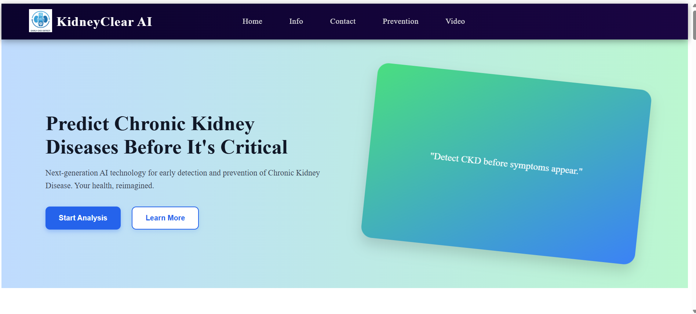

# Chronic Kidney Disease (CKD) Prediction

This project is a complete machine learning pipeline and web application designed to predict the presence of Chronic Kidney Disease (CKD) in a patient based on their medical parameters.

The project includes data preprocessing, exploratory data analysis, the training and comparison of four different machine learning models (ANN, Random Forest, Decision Tree, Logistic Regression), and a Flask web application to serve the best-performing model for real-time predictions.

## Demo

Click on [link](https://early-prediction-for-chronic-kidney-0aov.onrender.com) to see the demo website


## Project Structure

```
. ├── Dataset/ 
│ └── kidney_disease.csv 
├── static/ 
│ ├── css/ (assessment.css, info.css, result.css, style.css) 
│ ├── img/ (kidney-3d.png, logo.png) 
│ └── js/ (script.js) 
├── templates/ 
│ ├── assessment.html 
│ ├── contact.html 
│ ├── home.html 
│ ├── info.html 
│ ├── result.html 
│ └── test.html 
├── .gitattributes 
├── .gitignore 
├── app.py # Main Flask application 
├── benchmark_models_performance.png # Model comparison chart 
├── CKD_scaler.pkl # Saved scaler 
├── CKD.ipynb # Jupyter Notebook for model development 
├── ckd.keras # Saved ANN model 
├── CKD.pkl # Saved Logistic/RF/DT model 
├── readme.md # Project Readme 
├── requirements.txt # Python dependencies 
├── retrain_model.py 
└── test_predictions.py
```


## Technology Stack

* **Backend:** Python, Flask
* **Frontend:** HTML, CSS, JavaScript
* **Data Science:** Pandas, NumPy, Scikit-learn, TensorFlow/Keras
* **Data Visualization:** Matplotlib, Seaborn
* **Notebook:** Jupyter Notebook
* **Hosting:** Render
## Features

* **Interactive Web Interface:** A user-friendly web app built with Flask to input patient data and receive an instant prediction.
* **Data Cleaning:** Robust preprocessing pipeline to handle missing values, data type inconsistencies, and categorical encoding.
* **Model Comparison:** Trains and evaluates four different classification models to find the best-performing one.
* **Performance Visualization:** Includes a saved plot (`benchmark_models_performance.png`) comparing the metrics of all trained models.
* **Saved Models:** All trained models (`.pkl`, `.keras`) and the data scaler (`.pkl`) are saved for easy deployment and reuse.
## Machine Learning Pipeline

The models were trained and evaluated in the `CKD.ipynb` notebook. The pipeline followed these key steps:

### 1. Data Loading & Preprocessing

* **Data Loading:** The dataset was loaded from `Dataset/kidney_disease.csv`.
* **Data Preprocessing:**
    * **Inconsistencies:** Fixed class labels (e.g., `'ckd\t'` → `'ckd'`).
    * **Type Conversion:** Converted object-type numerical columns (like `'pcv'`, `'wc'`) to numeric.
    * **Missing Values:** Filled continuous columns with their **mean** and categorical columns with their **mode**.
    * **Label Encoding:** Converted all categorical text columns to numerical labels using `LabelEncoder`.

---

### 2. Exploratory Data Analysis (EDA)

* A correlation heatmap was generated to understand feature relationships.
* Null values were visualized using `missingno` to confirm the cleaning process.

---

### 3. Feature Selection & Scaling

* A subset of important features was selected for modeling: `['rbc', 'pc', 'bgr', 'bu', 'pe', 'ane', 'dm', 'cad']`.
* The selected features were scaled using `StandardScaler` (which was saved to `CKD_scaler.pkl` for use in the app).

---

### 4. Model Training

Four different models were trained on the preprocessed data:
* Artificial Neural Network (ANN)
* Random Forest Classifier
* Decision Tree Classifier
* Logistic Regression

---

### 5. Model Evaluation

* Models were evaluated using **Accuracy, Precision, Recall, F1-Score, and ROC-AUC**.
* **5-fold cross-validation** was used for a reliable performance measurement.
* Confusion matrices were plotted for all models.
* The final performance comparison was saved as `benchmark_models_performance.png`.

---

### 6. Model Saving

* The best-performing models were saved for deployment:
    * Logistic Regression (or other) → `CKD.pkl`
    * ANN Model → `ckd.keras`
## Usage

- **Run the Flask Web Application:**
    ```bash
    python app.py
    ```
    Open your web browser and navigate to `http://127.0.0.1:5000`.

- **Explore the Model Development:**
    To understand how the models were trained and evaluated, you can run the Jupyter Notebook:
    ```bash
    jupyter notebook CKD.ipynb
    ```
## Run Locally


- **Clone the repository:**

    ```bash
  git clone https://github.com/BaljeetkumarPatel/Early-Prediction-for-Chronic-Kidney-Disease-Detection
    ```
    ```bash
  cd Early-Prediction-for-Chronic-Kidney-Disease-Detection
    ```
- **Install the required dependencies:**

    ```bash
  pip install -r requirements.txt
    ```

- **Run**

    ```bash
  python app.py
    ```
  


## Screenshots




## Results

"All four models performed well, with the Artificial Neural Network and Logistic Regression models achieving over 98% accuracy on the test set. The Logistic Regression model (`CKD.pkl`) was ultimately chosen for deployment in the web app due to its high performance and interpretability."
## Acknowledgements

* **Dataset:** [Chronic Kidney Disease Dataset (Kaggle)](https://www.kaggle.com/datasets/mansoordaku/ckdisease)
## Badges


## Machine Learning Pipeline

The models were trained and evaluated in the `CKD.ipynb` notebook. The pipeline followed these key steps:

### 1. Data Loading & Preprocessing

* **Data Loading:** The dataset was loaded from `Dataset/kidney_disease.csv`.
* **Data Preprocessing:**
    * **Inconsistencies:** Fixed class labels (e.g., `'ckd\t'` → `'ckd'`).
    * **Type Conversion:** Converted object-type numerical columns (like `'pcv'`, `'wc'`) to numeric.
    * **Missing Values:** Filled continuous columns with their **mean** and categorical columns with their **mode**.
    * **Label Encoding:** Converted all categorical text columns to numerical labels using `LabelEncoder`.

---

### 2. Exploratory Data Analysis (EDA)

* A correlation heatmap was generated to understand feature relationships.
* Null values were visualized using `missingno` to confirm the cleaning process.

---

### 3. Feature Selection & Scaling

* A subset of important features was selected for modeling: `['rbc', 'pc', 'bgr', 'bu', 'pe', 'ane', 'dm', 'cad']`.
* The selected features were scaled using `StandardScaler` (which was saved to `CKD_scaler.pkl` for use in the app).

---

### 4. Model Training

Four different models were trained on the preprocessed data:
* Artificial Neural Network (ANN)
* Random Forest Classifier
* Decision Tree Classifier
* Logistic Regression

---

### 5. Model Evaluation

* Models were evaluated using **Accuracy, Precision, Recall, F1-Score, and ROC-AUC**.
* **5-fold cross-validation** was used for a reliable performance measurement.
* Confusion matrices were plotted for all models.
* The final performance comparison was saved as `benchmark_models_performance.png`.

---

### 6. Model Saving

* The best-performing models were saved for deployment:
    * Logistic Regression (or other) → `CKD.pkl`
    * ANN Model → `ckd.keras`
